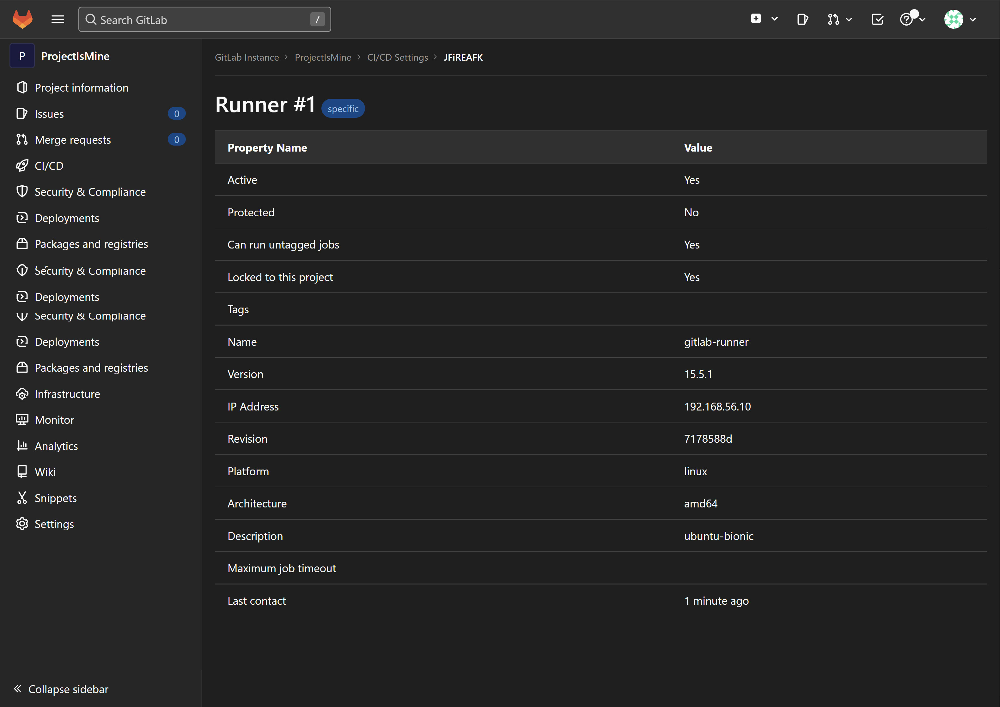
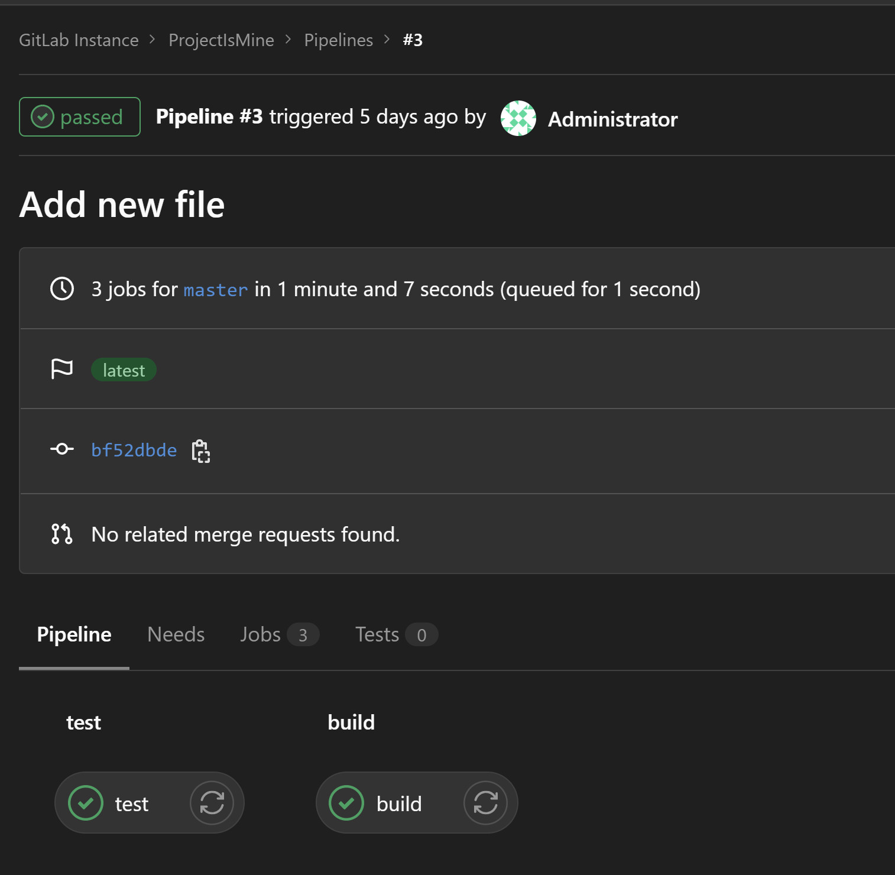
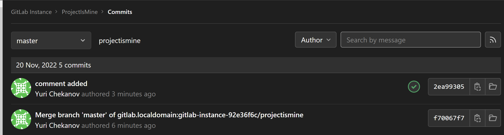
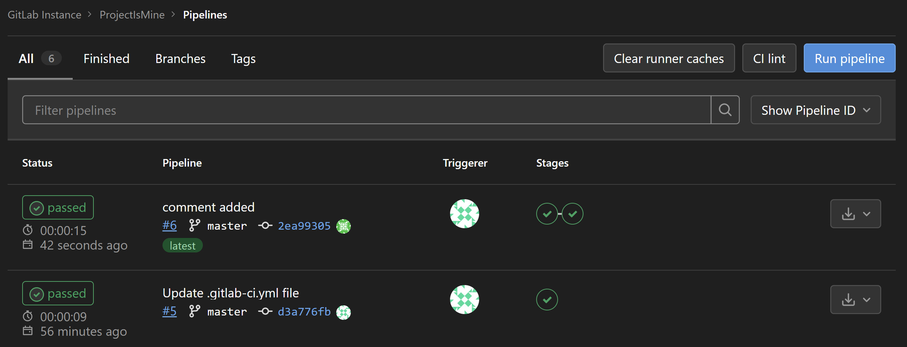

# Домашнее задание к занятию "`8.3. Gitlab`" - `Юрий Чеканов`

---

[Выполененое задание в формате Google Docs](https://docs.google.com/document/d/1gJWIZWVaoUuMNMmf_eguF5DjoKC9_imGh5dl0furbHs/edit?usp=sharing)

---

### Задание 1

Разверните Gitlab локально, используя Vagrantfile и инструкцию.
Создайте новый проект и пустой репозиторий в нём.
Зарегистрируйте gitlab-runner для этого проекта и запустите его в режиме docker. 
Раннер можно регистрировать и запускать на той же виртуальной машине, на которой запущен gitlab.
В качестве ответа добавьте в репозиторий шаблона с решением скриншоты с настройками раннера в прокте.

<ins>*`Ответ:`*<ins>




---

### Задание 2

Запушьте репозиторий на GitLab, изменив origin (это изучалось на занятии по Git)
Создайте `.gitlab-ci.yml`, описав в нем все необходимые на ваш взгляд этапы.
В качестве ответа добавьте в шаблон с решением:
- файл `.gitlab-ci.yml` для своего проекта или вставьте код в соответствующее поле в шаблоне,
- скриншоты с успешно собранными сборками.

<ins>*`Ответ:`*<ins>
 

```yaml
stages:
  - test
  - build
 
test:
  stage: test
  image: golang:1.17
  script:
   - go test .
 
build:
  stage: build
  image: docker:latest
  script:
   - docker build .
```
<ins>`Результат выполнения pipeline:`<ins>




---

### Задание 3

* Измените CI таким образом, чтобы:
	* Этап сборки запускался сразу, не дожидаясь результатов тестов;
	* Тесты запускались только при изменении файлов с расширением *.go.

В качестве ответа добавьте в шаблон с решением файл gitlab-ci.yml своего проекта или вставьте код в соответствующее поле в шаблоне.

<ins>*`Ответ:`*<ins>

```yaml
stages:
  - build
  - test
 
test:
  stage: test
  image: golang:1.17
  only:
    changes:
      - '*.go'
  script:
   - go test .
 
build:
  stage: build
  image: docker:latest
  script:
   - docker build .
```
1. `git pull`
2. `nano main_test.go  → comment added`
3. `git add main_test.go`
4. `git commit -m "comment added"`
5. `git push`



Перед изменением main_test.go,в pipeline отработал только stage “build”, т.к. go-файлы не были изменены.
